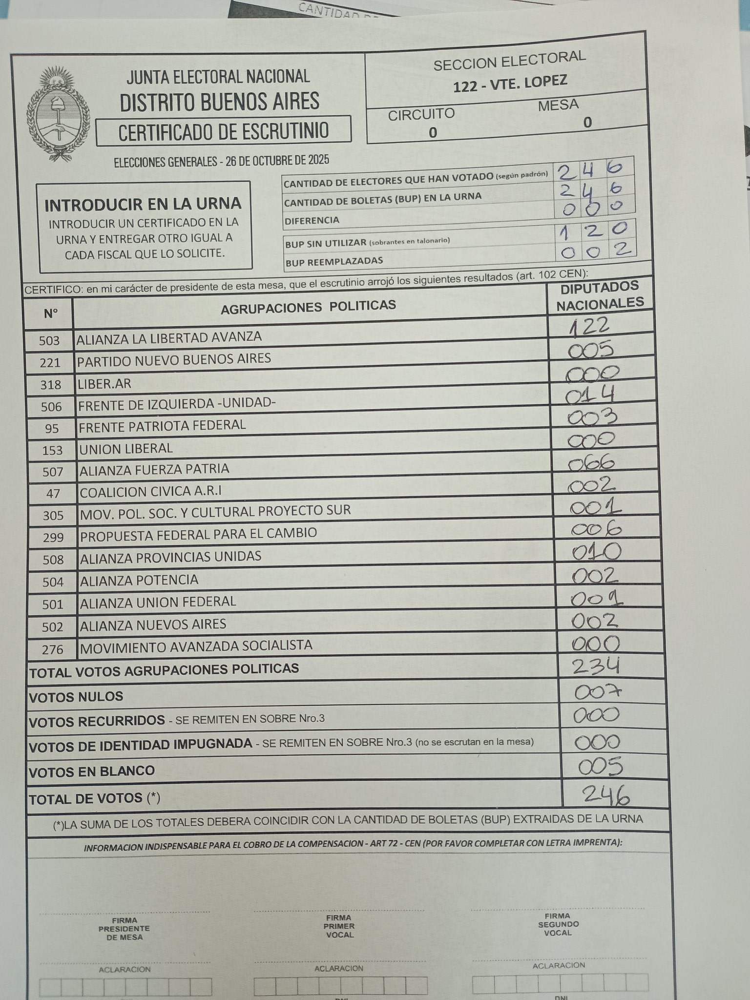

# Actas MVP

Bot de Telegram para la digitalización automática de actas de escrutinio electoral mediante inteligencia artificial.

## Contexto y objetivo

En una elección nacional, la información no solo tiene que ser correcta: también tiene que llegar antes de perder valor. Entre el cierre de la votación y la publicación de resultados se abre una ventana breve en la que los partidos políticos necesitan ordenar señales dispersas, interpretar tendencias y sostener decisiones internas con un grado razonable de confianza.

En la práctica, el circuito por el que esos datos se mueven sigue siendo artesanal: el fiscal partidario fotografía el acta y la envía por mensaje a un centro de cómputos interno, donde otras personas leen la imagen y transcriben manualmente los resultados. Esto genera pérdidas de tiempo, riesgo de error y uso intensivo de recursos.

**El objetivo de esta tesis es determinar si resulta técnica y operativamente viable automatizar la carga de datos contenidos en las actas de mesas testigo de los partidos políticos a partir de imágenes.** Para ello se compararon herramientas de OCR tradicional y modelos de lenguaje multimodal, y se desarrolló este prototipo funcional que traslada esa capacidad técnica a una solución concreta.

## Ejemplo de acta procesada



## Flujo del sistema

1. El fiscal toma una foto del acta y la envía por Telegram
2. El bot rescala la imagen y la envía a la API de Gemini
3. Gemini localiza la tabla manuscrita y extrae el código de mesa y los votos
4. Los resultados se guardan como una fila en Google Sheets

## Estructura de Google Sheets

Una fila por acta con las siguientes columnas:

| CODIGO_MESA | ALIANZA LA LIBERTAD AVANZA | PARTIDO NUEVO BUENOS AIRES | ... | TOTAL DE VOTOS |
|---|---|---|---|---|
| 0-122-312 | 122 | 5 | ... | 246 |

El código de mesa se forma como `circuito-sección-mesa` y es extraído automáticamente del encabezado del acta.

## Setup

### 1. Clonar e instalar dependencias
```bash
git clone <repo-url>
cd actas-mvp
pip install -r requirements.txt
```

### 2. Configurar credenciales
```bash
cp .env.example .env
# Completar .env con tus credenciales
```

Colocar el JSON de la service account de Google en `credentials/service_account.json`.

### 3. Correr
```bash
python main.py
```

## Variables de entorno

| Variable | Descripción |
|---|---|
| `TELEGRAM_BOT_TOKEN` | Token del bot obtenido desde @BotFather |
| `GEMINI_API_KEY` | API Key de Google AI Studio |
| `GOOGLE_SHEETS_ID` | ID de la planilla (en la URL de Sheets) |
| `GOOGLE_CREDENTIALS_PATH` | Ruta al JSON de la service account |